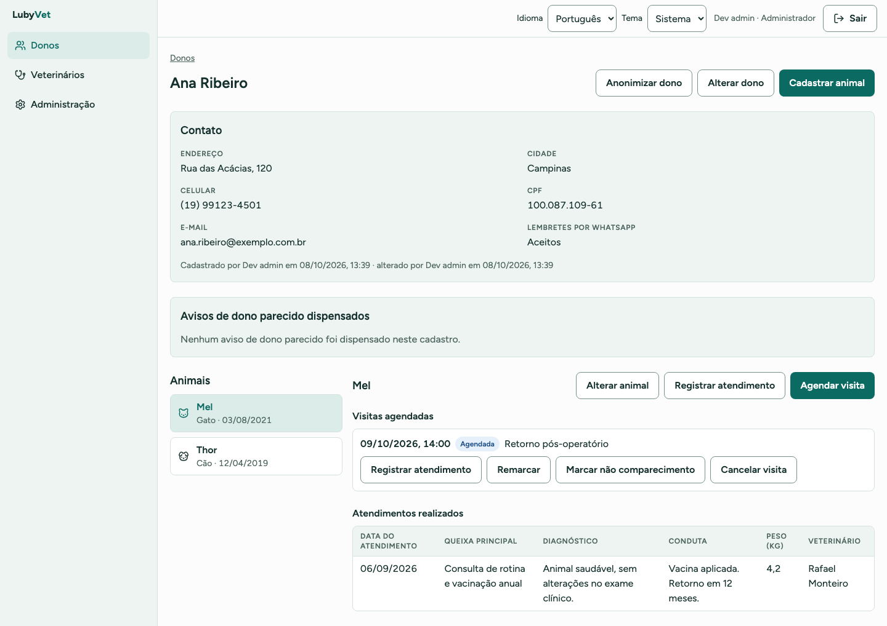
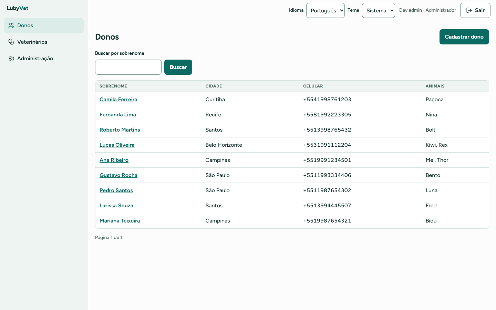
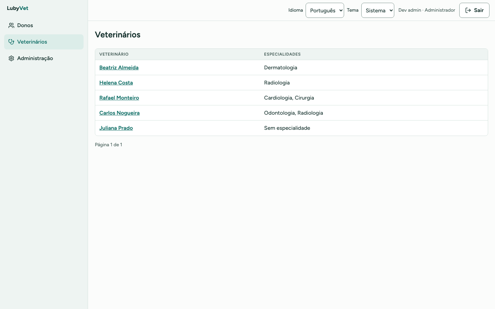
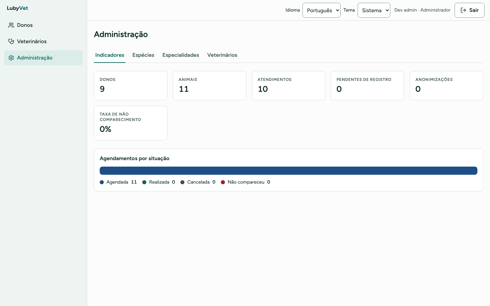
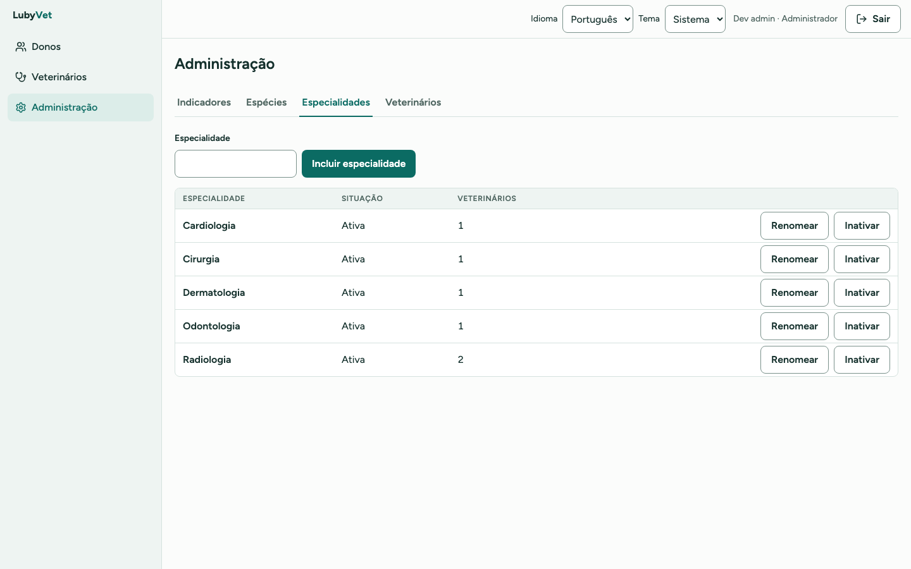
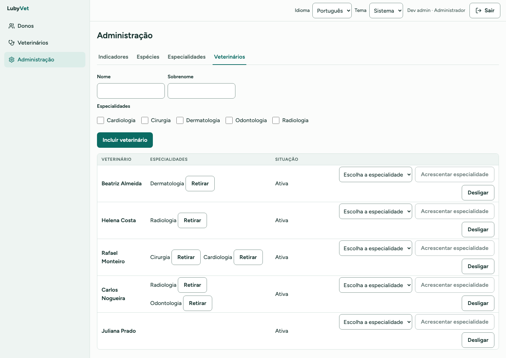
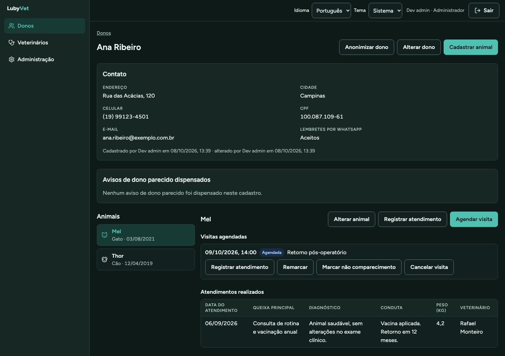

# LubyVet

Sistema de balcão de clínica veterinária. A recepção cadastra donos e animais, agenda e
registra visitas e consulta o catálogo de veterinários. O Administrador mantém os
vocabulários (espécies e especialidades) e as contas da equipe. O sistema envia lembrete
de consulta por WhatsApp na véspera.

O LubyVet é um sistema **novo, escrito a partir de especificações**. As especificações
saíram da análise do [spring-petclinic](https://github.com/spring-projects/spring-petclinic),
a aplicação de referência do ecossistema Spring. Do código do spring-petclinic nada foi
reaproveitado: nem classe, nem template, nem folha de estilo, nem esquema de banco. O que
passou de um para o outro foi o conhecimento do domínio: 48 regras de negócio, 5
contradições entre camadas e as lacunas do modelo. Cada lacuna foi decidida por uma pessoa
e registrada antes de virar código.

## Interfaces

As telas abaixo foram capturadas com o perfil de Administrador, sobre dados de
demonstração.

**Ficha do dono.** Contato, autoria das alterações, animais, visitas agendadas e
atendimentos realizados, tudo a partir do dono.



**Lista de donos**, com busca por sobrenome e os animais de cada um.



**Catálogo de veterinários**, com as especialidades de cada um.



**Administração.** Indicadores de operação, manutenção das especialidades e quadro de
veterinários.







**Tema escuro.** A interface inteira tem os dois temas, e os dois passam pela checagem
automática de acessibilidade.



## Como o projeto foi construído

O spring-petclinic foi lido por inteiro, e dele saíram as regras de negócio, as
contradições entre camadas e as perguntas que só uma pessoa podia responder. As respostas
viraram decisões registradas, e os problemas estruturais do sistema de origem viraram nove
princípios que nenhuma mudança pode violar. Cada funcionalidade foi descrita com critérios
de aceite numerados antes de existir código, e cada critério tem um teste de aceitação com
o mesmo nome, rodando contra a pilha real. Nada é entregue sem o veredito verde.

A suíte do spring-petclinic também foi executada, para servir de referência do
comportamento original: 79 testes, 0 falhas e 2 pulados, no commit `500158f` do upstream.

## Os dois sistemas lado a lado

| | spring-petclinic | LubyVet |
|---|---|---|
| propósito | aplicação de exemplo do Spring, para demonstrar o framework | sistema para operar uma clínica de verdade |
| arquitetura | monólito MVC, telas renderizadas no servidor (Thymeleaf) | portas e adaptadores; API NestJS como única porta do domínio; front Next.js só de apresentação |
| linguagem | Java 17, Spring Boot 4.1 | TypeScript, Node 24 |
| banco | três dialetos em paralelo (H2, MySQL, PostgreSQL), cada um com o próprio `schema.sql` | PostgreSQL como único dialeto; 17 migrações Prisma versionadas |
| evolução do esquema | esquema recriado a cada inicialização, sem ferramenta de migração | só por migração; teste de integração compara o esquema migrado com o modelo |
| identidade e acesso | nenhuma: qualquer pessoa lê e altera qualquer ficha | login da equipe com três papéis (leitura, escrita, Administrador) e uma matriz por rota |
| dado pessoal (LGPD) | sem caminho de exclusão, sem data de criação ou alteração | anonimização por entidade, datas de criação e alteração, histórico preservado |
| concorrência | o último a gravar vence, em silêncio | controle otimista por versão; conflito devolve 409 com os valores atuais |
| erros | sem tratador de exceção: dono inexistente na URL vira erro 500 | envelope de erro declarado no contrato, com código por campo e 404 explícito |
| contrato HTTP | implícito, espalhado nos parâmetros dos fragmentos de template | schemas zod em `packages/contracts`, compartilhados entre API e web |
| cache | catálogo em memória sem prazo de validade nem invalidação | Redis com prazo configurável e invalidação quando o catálogo muda |
| mensageria | não há | RabbitMQ e um worker para os lembretes de WhatsApp (Meta) |
| idiomas da interface | 10 idiomas, com mensagens de confirmação em inglês literal no código | pt-BR e en; todo texto visível sai do catálogo |
| build | Maven e Gradle em paralelo, sem que nenhum fosse a verdade | um workspace, um lockfile (`bun.lock`), um comando de veredito |
| entrega | manifestos Kubernetes de exemplo, banco efêmero | Helm chart agnóstico de provedor, painéis Grafana e ensaio de restauração de backup na CI |
| observabilidade | Actuator | OpenTelemetry; sondas abertas e o resto da superfície só para o Administrador |

## Qualidade técnica

O spring-petclinic é bem escrito para o que se propõe: ensinar Spring. Os problemas abaixo
não são descuido. São o que acontece quando regras importantes ficam implícitas na
estrutura do código, e uma aplicação de exemplo nunca precisou torná-las explícitas. Cada
princípio do LubyVet nasceu de um desses pontos e tem um teste que reprova quem o violar.

### Isolamento entre clientes

- **No spring-petclinic,** o isolamento existia por acidente. Todo acesso a animal passava
  por `owner.getPet(petId)`, que só varre os animais daquele dono, e não havia repositório
  de animal nem de visita. Nenhuma linha dizia que isso era intencional e nenhum teste
  verificava. Trocar aquela chamada por uma busca direta abriria a ficha de um cliente para
  outro, e a suíte continuaria verde.
- **No LubyVet,** animal e visita só se alcançam pelo dono, em todas as camadas. Existe um
  teste que pede o animal de um dono com o identificador de outro e espera recusa. Esse
  teste foi escrito antes da implementação.

### Uma regra, um limite

- **No spring-petclinic,** havia três esquemas mantidos à mão, um por dialeto, e quatro
  comportamentos mudavam conforme o perfil escolhido. Não existia "o comportamento do
  sistema", existiam três. Dessa divergência saíram quatro das cinco contradições entre
  camadas. Duas eram graves:
  - Editar um animal sem espécie passava pela aplicação, batia na restrição do banco e
    terminava em erro 500, sem mensagem de campo.
  - A mensagem de nome duplicado era decidida procurando o nome da restrição dentro do
    texto da exceção. Num dos dialetos a restrição era anônima, e o usuário via erro 500.
- **Também no spring-petclinic,** 18 das 24 colunas tinham o nome derivado de uma única
  linha de configuração, e nenhum teste comparava esse nome com o DDL.
- **No LubyVet,** há um dialeto só e o esquema só muda por migração. Toda coluna tem nome
  declarado. Os limites de tamanho existem na validação e no banco com o mesmo número, e o
  teste prova os dois lados. Regras críticas também vivem no próprio banco (CHECKs,
  unicidade), e um teste de integridade tenta violar cada uma. O erro é reconhecido pelo
  tipo, nunca pelo texto da exceção.

### Identificador e "registro novo"

- **No spring-petclinic,** o predicado "ainda não foi gravado" tinha nove consumidores, três
  deles em templates que nenhum compilador verifica, e governava seis comportamentos. Se a
  aplicação passasse a gerar o identificador, os seis se inverteriam sem nenhuma falha de
  compilação e sem nenhum teste vermelho.
- **No LubyVet,** o identificador nasce no banco e "novo" é exatamente "sem id". Cada
  comportamento que depende disso tem um teste que nomeia essa dependência.

### Dado pessoal

- **No spring-petclinic,** nome, endereço e telefone de pessoa física eram guardados sem data
  de criação e sem nenhum caminho de exclusão. As chaves estrangeiras não declaravam o que
  fazer ao apagar. O direito de eliminação da LGPD (art. 18) não tinha onde se encaixar.
- **No LubyVet,** nada se apaga: dado pessoal se anonimiza. Cada tabela com dado pessoal tem
  um teste que anonimiza um registro e confere três coisas: o dado identificável saiu, o
  histórico vinculado continuou existindo e a data de alteração mudou.

### Contrato e erros

- **No spring-petclinic,** renomear um parâmetro de fragmento de template mudava o contrato
  HTTP sem tocar em uma linha de Java. O endpoint do catálogo expunha estado interno de
  persistência. E sem tratador de exceção, URL com dono inexistente virava erro 500.
- **No LubyVet,** rota, campo, envelope e status são contrato escrito antes do código, em
  zod, e mudam só com decisão registrada. Cada rota tem teste de contrato.

### Textos da interface

- **No spring-petclinic,** a interface tinha 10 idiomas, com teste de completude. Mesmo
  assim, as seis mensagens de confirmação de gravação estavam em inglês literal no código.
  O catálogo carregava chaves sem consumidor, e o código usava chaves que não existiam em
  arquivo nenhum.
- **No LubyVet,** todo texto visível sai do catálogo. A verificação falha tanto com chave
  faltando quanto com chave sem uso.

### Um veredito só

- **No spring-petclinic,** Maven e Gradle conviviam com dependências divergentes e dois
  fluxos de CI. A cobertura era medida em só um deles, e por isso nenhum número de
  cobertura podia ser citado.
- **No LubyVet,** `bun run verify` é o único veredito, e a CI roda o mesmo comando. Ele
  executa, nesta ordem:
  1. procura de segredos
  2. lint sem nenhum aviso
  3. checagem de formatação
  4. checagem de tipos
  5. regra de fronteira entre camadas (dependency-cruiser)
  6. testes de unidade com cobertura mínima
  7. integração com Postgres, Redis e RabbitMQ reais (Testcontainers)
  8. e2e da API
  9. Playwright no web, com axe nos dois temas
  10. aceitação por critério

  A cobertura mínima é de 90% de linhas e de ramos em domínio e casos de uso. A
  aceitação também confere a rastreabilidade: todo critério de uma funcionalidade entregue
  precisa ter teste.

### Em números

Medido em 2026-10-08.

| | spring-petclinic | LubyVet |
|---|---|---|
| código de produção | 1.899 linhas Java + 536 linhas de template | 9.022 linhas TypeScript (API 4.973, web 3.439, contratos 610) |
| código de teste | 2.398 linhas, 18 suítes | 8.967 linhas |
| testes | 79 executados (2 pulados sem Docker) | 657: contratos 15, unidade da API 115, componentes do web 89, integração 45, e2e da API 171, Playwright 32, aceitação 190 |
| cobertura mínima exigida | nenhuma | 90% em domínio e casos de uso |
| critérios de aceite rastreados até um teste | não há critérios escritos | todos os das funcionalidades entregues |
| decisões de projeto registradas | não há registro | mais de 70, entre decisões e padrões |

### O que o LubyVet custa a mais

A comparação não é de graça, e vale dizer o que se trocou:

- **Mais código e mais peças.** São cerca de quatro vezes mais linhas de produção e uma pilha
  com Postgres, Redis, RabbitMQ e Kubernetes, contra um único processo Java que sobe com
  H2 em memória. Parte da diferença vem do que o spring-petclinic simplesmente não tinha
  (acesso, LGPD, lembretes, concorrência). A outra parte é o preço da separação entre API,
  web e contratos.
- **Menos idiomas.** São dois idiomas, contra dez. Foi uma escolha de escopo.
  O catálogo e o teste de completude estão prontos para receber mais.
- **Verificação mais lenta.** O veredito completo sobe contêineres e roda navegador, e leva
  minutos. `bun run test:unit` é o ciclo rápido, em segundos e sem Docker.

## Como rodar

Pré-requisitos: Node 24 (`.nvmrc`), [bun](https://bun.sh) e Docker. Use o bun para instalar
e rodar: nesta máquina o npm encerra sem erro em scripts longos.

```bash
bun install
./run.sh                 # infra em Docker; API e web no host
./run.sh docker          # tudo em contêineres, em http://localhost:8088
./run.sh user            # cria ou atualiza usuário da equipe (variáveis LV_*)
bun run verify           # o único veredito: só se entrega verde
bun run test:unit        # ciclo rápido, sem Docker
```

A tabela completa de comandos está no [`AGENTS.md`](AGENTS.md).

## Mapa do repositório

```
apps/api/              NestJS: domínio, casos de uso e adaptadores (Prisma, Redis, RabbitMQ, Meta)
apps/web/              Next.js (App Router), shadcn/ui, Tailwind 4; só apresentação
packages/contracts/    schemas zod de entrada, saída e erro de cada rota
deploy/                Helm chart, painéis Grafana e ensaio de restauração
docs/padroes/          como o código é escrito e testado
```

Para contribuir, comece pelo [`AGENTS.md`](AGENTS.md). Os padrões de código e de teste
estão em [`docs/padroes/`](docs/padroes/).
